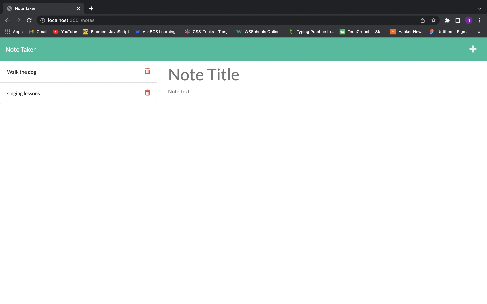

# Note taker app
## Description
allows user to writte and save notes through express

## Installation

- run 'npm i' in terminal

## Usage
- run 'node server.js' in terminal

## Visuals
 

## Questions 

- Github: lilwill13

- noahsfuture18@gmail.com

## Tabel of contents

- [Description](#description)

- [Installation](#installation)

- [Usage](#usage)

- [Visuals](#visuals)

- [Questions](#questions)